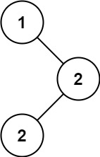

# 501.二叉搜索树中的众数

**难度：简单**

给你一个含重复值的二叉搜索树（BST）的根节点 `root` ，找出并返回 BST 中的所有 [众数](https://baike.baidu.com/item/众数/44796)（即，出现频率最高的元素）。

如果树中有不止一个众数，可以按 **任意顺序** 返回。

假定 BST 满足如下定义：

- 结点左子树中所含节点的值 **小于等于** 当前节点的值
- 结点右子树中所含节点的值 **大于等于** 当前节点的值
- 左子树和右子树都是二叉搜索树

**示例 1：**



```
输入：root = [1,null,2,2]
输出：[2]
```

**示例 2：**

```
输入：root = [0]
输出：[0]
```

**提示：**

- 树中节点的数目在范围 `[1, 104]` 内
- `-105 <= Node.val <= 105`

**进阶：**你可以不使用额外的空间吗？（假设由递归产生的隐式调用栈的开销不被计算在内）

## 解题思路

二叉搜索树的两大性质：

1. 二叉搜索树是一个有序树：
   - 若它的左子树不空，则左子树上所有结点的值都小于它的根结点的值；
   - 若它的右子树不空，则右子树上所有结点的值都大于它的根结点的值；
   - 它的左、右子树也分别为二叉搜索树
2. 二叉搜索树的中序遍历结果是一个递增序列

根据性质 2，我们可以知道在二叉搜索树的中序遍历结果中，相等的元素一定是相邻的，这给我们找众数提供了很大遍历。

中序遍历以后，这道题就变成了：**在有序序列中寻找众数。**

核心逻辑：

1. **中序遍历准备**：使用一个栈来辅助非递归的中序遍历过程，以及定义 `pre`（前一个访问的节点）和 `cur`（当前访问的节点）变量来跟踪遍历。同时，维护`curCount`（当前值的出现次数）和 `maxCount`（迄今为止的最大出现次数）来记录出现频率。
2. **中序遍历执行**：遵循中序遍历的顺序，首先遍历到每个节点的最左子节点。
   1. 对于每个节点，如果是第一个节点或者当前节点与前一个节点值不同，则重置 `curCount` 为 1
   2. 如果当前节点与前一个节点值，增加 `curCount`
3. **众数更新逻辑**：
   - 如果当前计数 `curCount` 大于最大计数 `maxCount`，**清空结果列表** 并添加当前值，同时更新 `maxCount`。
   - 如果 `curCount` 等于 `maxCount`，直接将当前值加入结果列表。
   - 上述操作确保了结果列表始终包含所有的众数。
4. **遍历完成后的处理**：将累积的众数列表转换成数组格式返回。

## 代码展示

```java
public int[] findMode(TreeNode root) {
    // 存储结果的列表
    List<Integer> ans = new ArrayList<>();
    // 用于中序遍历的栈
    Deque<TreeNode> stack = new LinkedList<>();
    // 上一个访问的节点
    TreeNode pre = null;
    // 当前访问的节点
    TreeNode cur = root;
    // 当前众数的出现次数和当前值的出现次数
    int maxCount = 0;
    int curCount = 0;

    // 中序遍历
    while (cur != null || !stack.isEmpty()) {
        // 遍历到最左边
        while (cur != null) {
            stack.push(cur);
            cur = cur.left;
        }
        cur = stack.pop();

        // 如果是第一个节点或者当前节点与前一个节点值不同
        if (pre == null || pre.val != cur.val) {
            curCount = 1;
        } else {
            // 如果当前节点与前一个节点值相同
            curCount++;
        }

        // 更新结果列表
        if (curCount > maxCount) {
            ans.clear();
            ans.add(cur.val);
            maxCount = curCount;
        } else if (curCount == maxCount) {
            ans.add(cur.val);
        }

        // 更新前一个节点为当前节点，移动到右子树继续遍历
        pre = cur;
        cur = cur.right;
    }

    // 将结果列表转换为数组并返回
    return ans.stream().mapToInt(Integer::intValue).toArray();
}
```

时间复杂度：O(n)，其中 n 是二叉树的节点数。每一个节点恰好被遍历一次。

空间复杂度：O(h)，其中h是树的高度。在最坏的情况下，栈中可能需要存储与树的高度相当数量的节点。对于一棵平衡二叉树，空间复杂度是O(log n)，而对于非平衡二叉树，最坏情况下的空间复杂度可能达到O(n)。

## 总结

二叉搜索树的两大性质：

1. 二叉搜索树是一个有序树：
   - 若它的左子树不空，则左子树上所有结点的值都小于它的根结点的值；
   - 若它的右子树不空，则右子树上所有结点的值都大于它的根结点的值；
   - 它的左、右子树也分别为二叉搜索树
2. 二叉搜索树的中序遍历结果是一个递增序列
