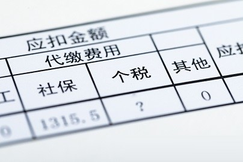
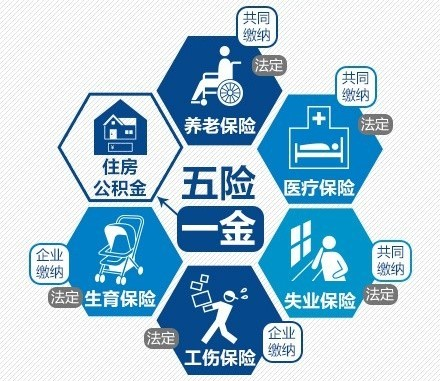
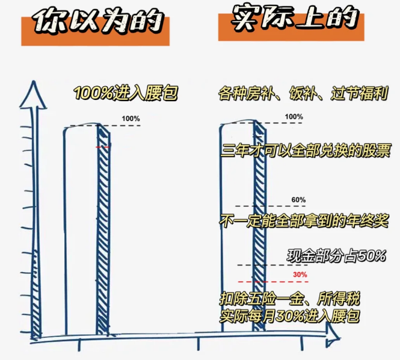
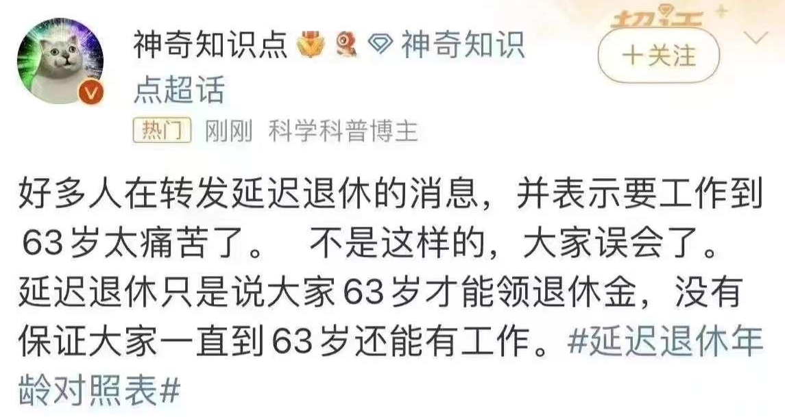
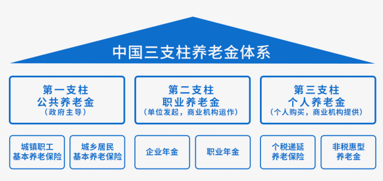
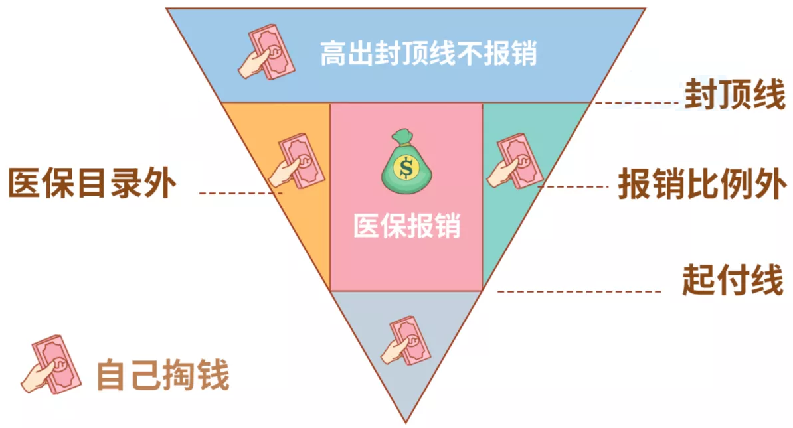
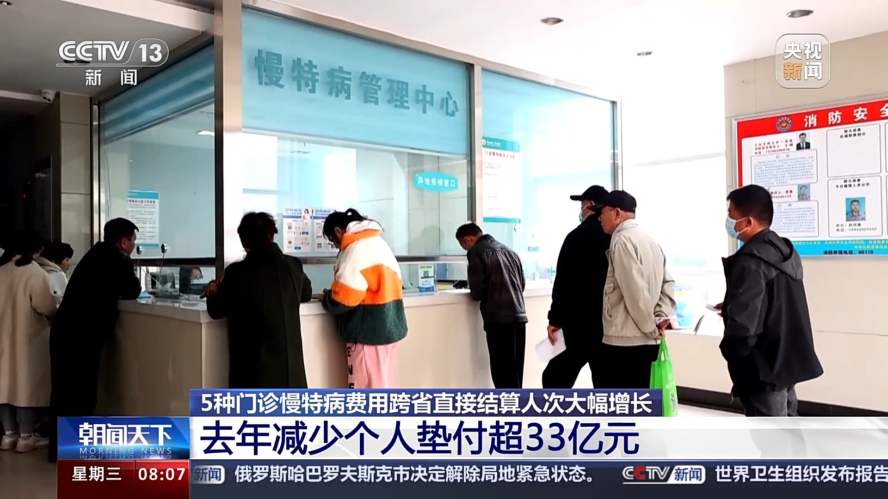
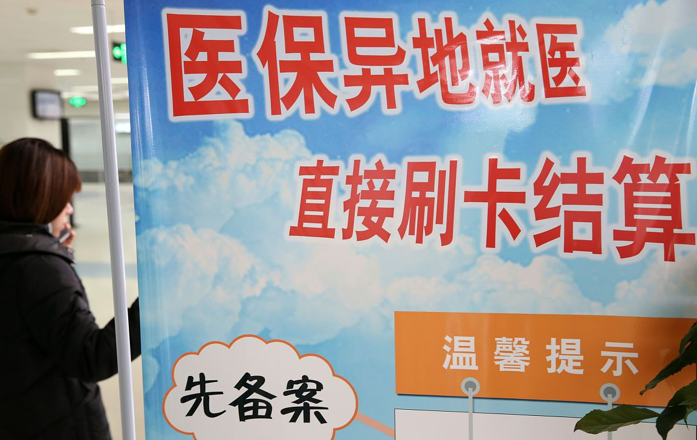
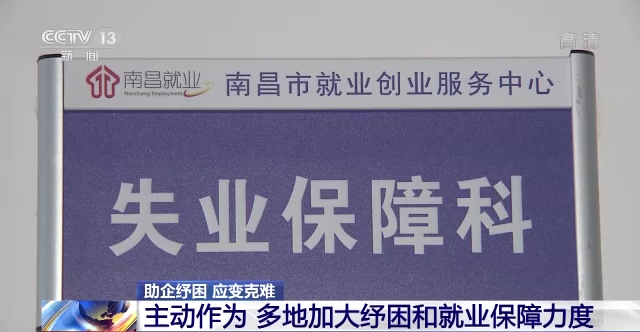
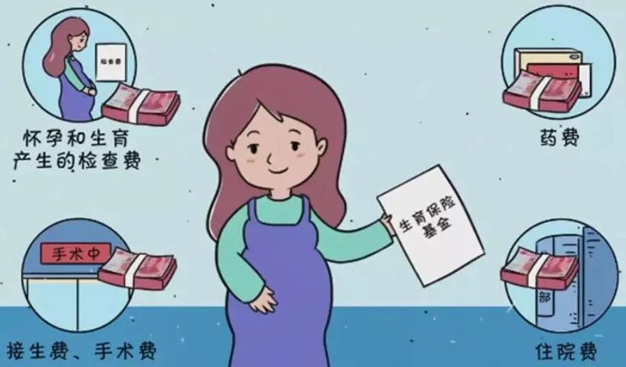

# 毕业生必看的薪资结构解析

## 前言

为什么在招聘的时候，公司 hr 说好给你月薪 1 万，结果入职后每月实际到手工资只有 8 千呢，剩下的 2 千去哪里了？

其实，我们每个月的工资在到手前，公司都会从中抽出两笔资金上交国家，这两笔资金就是我们常说的 **五险一金（仅指个人缴纳的部分）** 和 **个人所得税**。

所以公司 hr 说的是税前薪资，而你真正到手的则是税后薪资，二者的计算公式为：**税后薪资 = 税前薪资 − 社保及公积金个人缴纳部分 − 个人所得税**

我们常听到的一个词： **用人成本**，指的就是公司在职工身上投入的总成本，包含 **税前年薪（基本工资、绩效奖金、年终奖等）**、**企业承担的五险一金部分** 以及其他福利、培训等额外支出。把用人成本折半，基本上可以估算出你的税后到手收入了。

## 五险一金是什么

**五险** 是指我国建立的 **基本养老保险、基本医疗保险、工伤保险、失业保险、生育保险** 这五类社会保险制度，目的是保障公民在年老、疾病、工伤、失业、生育的情况下依法从社会获得物质帮助的权利。

**一金** 指的是住房公积金，它是单位及职工缴存的长期住房储蓄资金，是住房分配货币化、社会化和法制化的主要形式，也是我国法律规定的住房社会保障制度。职工个人缴存以及单位为职工缴存的公积金，都归职工个人所有。

在五险中，**养老保险** 和 **医疗保险** 采用了“统账结合”模式，也就是有明确的个人账户和统筹账户的划分（下文会介绍这是什么），而其余三险则只有统筹账户。

我们通常听到的 **三金、四金、三险一金、五险一金** 等概念，就是指涵盖的社保和公积金种类在数目上有所不同，像 **三金** 和 **三险一金** 就只涵盖了最基本的养老保险、医疗保险和失业保险，一金即住房公积金。

四金或五金则是加上了工伤保险和生育保险，而且很多时候四金指的是三险一金，只是把三险也称之为了 **金** 而已，因此员工和企业讨论薪资待遇的时候一定要问清楚这一点。

根据《社保法》，五险中的 **养老保险、医疗保险和失业保险** 这三项由企业和职工共同缴纳，而 **工伤保险和生育保险** 完全由企业承担，职工个人无需缴纳。

五险一金的缴纳额度因地区不同而有所差异，尤其是各地的 **缴纳比例** 和 **基数上下限** 会根据当地的社会经济情况调整。

## 缴存基数，理论与现实的碰撞

**社保缴存基数**，原则上采用的是职工上一年度的月平均工资。

也就是说，企业会以职工上一年度的月均工资为基础，再乘以相应的比例来给员工交社保。

但是，这个缴存基数有下限和上限，通常下限是社会平均工资的 60%，上限是社会平均工资的 300%。

以北京为例，下限约为 5300 块，上限约为 28000 块，这意味着，当你上年的月均工资在这个范围之间时，就以你实际的月均工资为缴存基数来交社保。如果你的月均工资低于或者超过此范围，则以 5300 或者 28000 为缴存基数。

### 深谙人性的当代发明：工资拆解

这里要谈到两个常见的误区。

- 一、很多人以为单位交社保的时候，拥有在刚才说的社会平均工资 60%到 300% 之间自由选择的权利，所以可以按最低标准来交。

错！只要你的月均工资超过最低标准了，就应该以你上一年度实际月均工资为基数来交社保。

- 二、很多人以为社保缴存基数只包括工资，可以不包括奖金。

现实中，企业把应该全额发给员工的钱进行拆分，把 **基本工资** 做的小小的，搞出来名目繁多的各种补贴、津贴、酬金、月度奖、季度奖、年终奖，让员工每次为了一点小福利沾沾自喜。

假设员工月工资两万块，如果把两万块都做成固定工资，那企业就陷入被动了，以后想要削减员工工资很容易引起不满。

于是企业把两万块拆分为八千块基本工资和一万二的奖金，再装模作样地搞个跟业绩挂钩的系数，让这一万二每个月稍有变动。

对外宣传自己的企业待遇好的时候，可以说每个月税前有两万左右，但当企业经营不善的时候，又有了绝佳的理由来削减成本：砍奖金就是了。

实际上，根据劳动和社会保障部社会保险事业管理中心《关于规范社会保险缴费基数有关问题的通知》：除非特别指出，社保缴存基数应该包括员工的所有工资性收入。

注意，不只是工资，而是 **工资性收入**。

计算口径使用的是国家统计局《关于工资总额组成的通知》中工资总额的构成，《通知》中不厌其烦地几乎把所有可能的工资性收入全都给列出来了。

所以理论上，**计算缴费基数时，年终奖、话费补贴、住房补贴、公交补助、餐补、过节费等都应该计入其中**。

而 **公积金的缴存基数** 和社保大体上保持一致，只是部分城市的规定稍有参差而已。

这么讲下来，你应该知道 **现实情况中**，绝大多数单位都存在少缴社保的问题，为什么会这样呢？真的是企业不乐意交社保吗？下文我们会详细解答，这里先按下不表。

## 养老保险

### 养老保险的作用和缴费规则

根据《社保法》和相关政策，用人单位为职工缴纳的 **基本养老保险费** 的比例一般在社保缴存基数的 16% 左右（此前的比例在 20%，但近年来国家进行了阶段性下调）。实际比例会根据地方政策有所调整，但 **一般不会超过社保缴存基数的 16%**，这部分钱会进入 **统筹账户**，用于社会化分配，以保障当前退休人员的养老金发放。

职工个人缴纳的养老保险比例通常为 **社保缴存基数的 8%**，这部分钱直接计入 **个人账户**。个人账户中的资金是职工退休后领取养老金的一个来源，属于个人所有，且可以继承。

注意：**养老金的缴纳年限有一个最低标准**：你需要累计缴满最低缴费年限，才能在退休后按月领取养老金。

而根据最新法律，从 **2030 年起**，最低缴费年限将逐步从 **15年提高至20年**。每年延长6个月，直到达到 20 年为止。

如果你在职期间累计缴满最低缴费年限，可以选择提前退出职场，但你仍然需要在 **达到法定退休年龄** 后（男性 63 岁，女性 58 岁或 55 岁，视具体岗位）才能开始领取养老金。

### 养老保险的统筹账户和个人账户

养老保险的缴费去向分为统筹账户和个人账户，每个账户的资金来源和用途有所不同。以下是一般的分配情况：

- **统筹账户**：由企业缴纳的养老保险费进入 **统筹账户**。用于支付所有退休职工的 **基础养老金**。这部分资金是社会统筹基金，保障每个退休职工都能领取基本养老金。
- **个人账户**：由个人缴纳的养老保险费全部计入 **个人账户**。主要用于 **积累** 个人的养老金储蓄。这部分资金由个人所有，退休后按月领取。同时，个人账户会按一定利率计算利息（一般略高于银行定期存款），每年年末进行结算后划入个人账户。

因此，养老保险的养老金由两部分组成：一部分是统筹账户中发放的基础养老金，另一部分是个人账户中累积的储蓄。

### 退休后，每个月能领到多少养老金

不考虑企业年金等因素，养老金的常规计算公式为：**每月领取金额 = 基础养老金 + 个人账户养老金**。

其中，**基础养老金 = ( 当地上年度社会平均工资 + 个人退休时的月平均缴费工资 ) × 缴费年限 × 1%**。

**个人退休时的月平均缴费工资** 指的是个人在整个职业生涯中的 **社保缴存基数** 的平均值（因为社保缴存基数每年会动态变化）。

而 **个人账户养老金 = 个人账户储存额 ÷ 计发月数**。其中，**个人账户储存额** 就是在个人每月缴费累积形成的账户金额。

**计发月数** 顾名思义就是养老金的计划发放月数，它是由政府按照职工退休时的年龄确定的，退休年龄越晚，计发月数就越小，每个月的养老金就越多。

一般情况下，60 岁退休时，计发月数为 **139**，55 岁为 **170**，50 岁为 **195**。

### 如何领取到更多的养老金

1. **缴费年限足够长**：缴纳养老保险的时间越长，你未来领取的养老金金额越高。
2. **缴费基数足够高**：社保缴费基数与工资挂钩，税前工资越高，你缴纳的养老保险金额越多，未来领取的养老金也会相应增加。
3. **寿命够长**：养老金按月发放，如果寿命较长，领取的养老金总额自然也会更多。

## 医疗保险

### 医保的作用和缴费规则

医疗保险的缴纳比例因地区和保险类型而有所不同。下面我们会主要讨论 **职工医保**，通常 **个人缴纳社保缴存基数的 2%**，企业则缴纳较大比例，一般在 **8% 至 10% 左右**（各地政策可能不同）。平时看病时的部分医疗费用可以通过医保报销。

我们要想享受医保报销，就必须 **连续缴纳**（每个月不断），因为 **医保断缴** 会导致医保待遇下个月就失效，而一旦断缴超过 3 个月，医保的缴费时间就要重新计算，照常缴纳 6 个月后医保待遇才能恢复（此期间医保仍不能报销）。

而要想退休后继续享受医保待遇，就必须达到医保的 **最低缴费年限**，通常为 25 至 30 年。

### 医保中的统筹账户和个人账户

医疗保险的缴费去向也分为统筹账户和个人账户，以下是一般的分配情况：

- **统筹账户**：企业缴纳的医保中，大部分资金都进入了 **统筹账户**，主要用于支付参保人的 **住院费用**、**大额医疗费用** 等。个人缴纳的医保全部或部分可能进入统筹账户，这部分在一些地区被用作 **统筹基金**，即医保账户中的公共资金。

- **个人账户**：个人缴纳的医保大多直接进入 **个人账户**，主要用于积累个人的医疗储蓄。这部分资金由个人所有，主要用于支付日常的门诊医疗费用、小额的药品费用等。企业缴纳的医保中的一小部分，通常按 **0.5% 至 2%** 的比例，也会划入个人账户。同时，个人账户也会产生利息，利率一般较低，由当地社保部门按年度或季度进行结算。

因此，小病小伤的门诊费用多从个人账户支出，只有当你发生了 **较大额的医疗支出**（如住院、手术等），统筹账户中的钱才会用于报销，报销就是指利用 **统筹基金** 来支付医疗费用，也就是常说的：花集体的钱。

下面我们聊一聊医保的报销规则。

### 取之于民，用之于民：医保报销

医保的报销通常分为 **门诊报销** 和 **住院报销** 两部分：

- **门诊**：在一些发达地区，门诊的医疗费用也可以通过 **统筹基金** 报销。报销的前提是你需要累计门诊付费达到一个 **起付线**（在医保目录内的你所付出的钱，即非个人自付的钱需要达到的标准）。

  每个地方的起付线不同，通常在 **400-800 元** 之间。例如，如果你所在地区的门诊起付线是 600 元，而你某次门诊花费了 800 元，其中符合医保目录的部分为 700 元，而报销比例是 60%，那么本次门诊你就可以报销 **(700 - 600) * 0.6 = 60 元**。

  而由于这次你超过了起付线，那么你之后在该年份内的门诊都可以直接以 60% 的比例报销了（因为这种累计到起付线的金额是每年重新计算的）。

  上述例子中，起付线以内的 600 元和不在医保目录的 100 元，**可以从个人账户中支付**，前提是你的个人账户有足够余额。

- **住院**：住院和门诊同理，费用的报销也有起付线，但住院的起付线金额不会累计计算，而是每次重新计算。不过，有些地方有 **多次住院起付线降低** 的政策，如果你在同一年内多次住院，后续住院的起付线可能会降低。

### 直接发钱更好吗？浅析个人账户存在的必要性

无论是养老保险还是医疗保险，**个人账户的存在** 不仅仅是一个资金储蓄的工具，它更是 **确保专款专用、避免短期消费、提供长期保障** 的重要机制。

如果直接把这笔钱发给职工，那么无法确保资金 **专门用于医疗和养老开支**，可能导致未来在医疗和养老问题上缺乏保障。

此外，个人账户具有 **免税性质、可累计性质**，能够有效确保参保人在需要时有稳定的资金储备。

### 门诊特殊病及门诊慢性病报销

对于一些 **特殊病种**（如肿瘤、糖尿病等慢性病），可以申请 **门特门慢** 报销，这类疾病的医疗费用可以单独申请报销，不会影响你普通门诊的 **统筹额度**。

因为普通门诊的统筹额度是有限的，部分地区每年有一定的报销上限，超过这个额度后，普通门诊的费用将不再由 **医保统筹基金** 报销。

### 异地就医报销，繁琐但有用

如果你需要 **异地就医**，比如去外地旅游或工作时发生意外，你可以通过医保小程序提前进行 **异地备案**。在短期异地使用医保时，报销比例会在你参保地基础上 **减少 10%**。对于长期异地工作的人（例如公司总部在 A 地，但你常驻 B 地工作），也可以通过医保小程序报备，这样在 B 地的医疗费用报销不会受到扣减。

### 社保之外，商业医疗保险的角斗场

对于商保，笔者还不了解，但一直听说充满了陷阱和套路，普通人很难找到好的商业医疗保险。

## 失业保险

### 失业保险的作用和缴纳规则

失业保险基金由 **用人单位和职工共同缴纳**，但缴费比例以企业为主，个人的缴费比例较低：

- **用人单位缴费**：根据社保缴存基数的 0.5% 至 1% 缴纳。
- **职工个人缴费**：通常按较低比例（如 0.2%）缴纳，直接从工资中代扣代缴。
- **政府补贴**：在部分地区，政府还会为失业保险基金提供一定补贴，确保基金的充足性和支付能力。

失业保险的主要功能是 **保障失业人员的基本生活**，在失业期间里，政府每个月会提供一定的经济补贴，并且也可以享受医保待遇。

失业保险金的 **可领取期限** 一般是按照失业前的 **缴费年限** 来确定，缴费年限越长，可领取的期限越长。例如，缴费 1 年可领取 3 个月，缴费满 10 年可领取 24 个月，且每个人 **一辈子最多只能领 24 个月**！

每个月的 **可领取金额** 一般在当地最低工资标准的 80% 至 90% 之间。

### 难领的失业金，严格的资格条件

失业保险金的领取条件主要包括以下几点：

- **缴费条件**：失业人员在失业前必须参加失业保险，并且缴费满一定年限（通常为1年）。
- **非自愿失业**：失业必须是 **非自愿** 的，即必须是因企业裁员、经济性裁员、合同期满未续签等原因导致的失业。
- **失业登记和求职意愿**：失业人员需要在失业后进行失业登记，并有求职意愿。

事实上，大多数地区的失业保险金并不好领，这里只列举部分原因：

- **非自愿失业**：如果是因为个人原因主动辞职（如个人发展、工作不满等），或因过失被解雇的情况，通常不符合领取失业金的条件（但在上海可以领）。
- **中途断缴**： 部分地区的失业保险还有 **连续缴费的时长** 要求。
- **失业登记的程序繁琐**：失业登记的流程比较复杂，需要提供相关证明材料，如解除劳动合同的证明、离职证明等，这也让一些人难以获得失业金。
- **稳岗补贴**：如果企业能把员工失业率控制在一定范围内，来年就能得到一定的政府补贴，相当于已缴的失业保险费能退回一部分。那么为了拿到这个补贴，企业当然会想方设法地降低 **明面上的失业率**。
- **劳动手册上的记录**：一旦领取过失业金，劳动手册上会留下领取记录，这可能被其他企业视作工作不稳定的标志。对于求职者来说，这样的记录可能会带来不必要的负面印象。

那么，我们是否可以注册一个公司，专门雇佣这些**主动辞职者**，再将其裁员以帮助他们领取失业金呢？

实际上，这种操作在当今社会确实存在，但这种人为制造“失业”的方式涉嫌 **骗取失业保险金**，属于严重违法行为。而且，当前社保系统已将参保数据与企业和员工的社保缴费记录关联，政府会严格核查企业的异常裁员情况，防止失业保险金被滥用或骗取，因此此类操作很难通过资格审查。

## 工伤保险

### 工伤保险的作用和缴费规则

工伤保险由 **用人单位全额缴纳**，职工个人无需缴费。

缴费比例因 **行业风险程度** 不同而有所差异，一般在 **0.2% 到 1.9%** 之间浮动，而例如采矿、建筑等高风险行业的缴费比例和上限通常会更高。

这项保险旨在为因工作原因受伤、患职业病或导致残疾、死亡的员工提供 **医疗费用、工资性收入补偿** 及 **伤残、死亡抚恤 **等支持，帮助其减轻经济负担。

### 不用白不用，日常如何申请工伤保险

如果你在上下班途中发生意外（例如被车撞），是完全可以申请工伤保险的。不过在实际操作中，工伤保险常因证据不足导致难以申领，因此事发后及时保存证据非常重要。

1. **立即报警**：在上下班途中发生交通事故时，务必立即报警，由交警到场调查、拍照取证。交警处理完毕后，会出具 **事故责任认定书** 等相关证明，这些文件在申请工伤保险时至关重要。
2. **保存医疗记录**：事故发生后，所有 **就医记录、病历、检查报告、住院证明** 等都应妥善保管。这些文件是申请工伤鉴定的重要材料。
3. **尽快通知单位**：在确认事故后，及时告知用人单位并提交所需材料。单位需将这些材料转交至社保部门申请工伤鉴定。

### 和时间赛跑，申请工伤的时效要求

![img](./assets/38647a25e1f7486e9ad5296b1341e3ea-180.jpg" alt="连上23天班后猝死，为什么没被认定为工伤？专家详解" style="zoom: 33%;" />

- **48小时规定**：如果职工在工作中突发疾病并 **在 48 小时内抢救无效死亡**，可认定为工伤。这点非常有争议，因为哪怕第一时间去了医院，但如果抢救超过了 48 小时才去世，可能无法认定为工伤。
- **事件的同时性和连贯性**：若职工在工作中感到不适，但未送医抢救，而是 **回家** 休息后 48 小时内死亡，则不会被视为工伤。

- **申报时限**：工伤发生后，用人单位应在 **30天内** 向工伤鉴定中心提交工伤认定申请。如果用人单位未及时申请，员工或其家属也可以在 **一年内** 提出申请，但建议尽量在 30 天内提交，以便尽早进入工伤鉴定程序。
- **自我申报**：如果单位不配合，你可以自行带上材料（事故认定书、医疗记录等）到工伤鉴定中心申请工伤认定，但最好不超过 30 天，以免影响鉴定结果。

## 生育保险

### 生育保险的作用和缴费规则

生育保险主要由 **用人单位全额缴纳**，职工个人无需缴费，缴费比例一般为工资总额的 **0.5% 到 1%**。

这项保险旨在为女职工在生育期间提供一系列保障：

- **生育医疗费用**：报销怀孕和分娩期间产生的各项医疗费用，包括产前检查、分娩费用、产后护理、住院费以及与分娩相关的检查和治疗费用。
- **生育津贴**：女职工在享受产假期间可以领取生育津贴，作为收入补偿。
- **计划生育手术费用**：除分娩外，生育保险还覆盖一些计划生育手术的医疗费用，例如 **上环、取环、流产、引产** 等。
- **产前检查费用**：部分地区的生育保险还覆盖产前所必要的检查费用，例如 B 超、化验等。

女职工的生育保险报销比例通常为 **全额报销**，前提是在定点医院进行的费用支出。

要想享受到生育保险，职工通常需要满足以下条件：

- **连续缴费**：在一些地区，女职工需要在生育前 **连续缴纳** 生育保险满一定时间，如 6 个月或 12 个月。
- **计划生育**：超生或违反 **计划生育** 政策的情形可能无法享受生育保险待遇。

### 生育津贴的计算公式

- 生育津贴 = 社保缴存基数 ÷ 30 天 × 产假天数
- 产假天数通常包括 **基础产假（98天）**，以及符合特殊情况时的额外假期（如难产、双胞胎等）。

### 性别歧视？生育保险对男性的意义

生育保险虽然看似只作用于女性，但其实对男性职工及其家庭也有重要意义。

在某些地区，**男职工的配偶 **如果没有生育保险（例如家庭主妇或自由职业者），男职工可以申请 **生育医疗费用补助**，为配偶的生育医疗费用提供部分保障（通常是 **费用的一半**），但无法领取生育津贴。

此外，我们在上文提到过，生育保险还覆盖一些计划生育手术的医疗费用，那么男职工如果需要做 **绝育手术**，生育保险一样可以报销。

## 住房公积金

### 公积金的作用和缴费规则

打工人一定要关注公积金！

谈到社保，我们认为这是 **通过集体统筹来解决当前的社会需求** ，或是 **为了将来的个人利益保障**。

但公积金不一样，它切切实实地属于当下的员工自己，即便你没买房，靠租房也可以 **提取公积金**，实现真正把公积金揣进口袋。

因此，很多人对自己的实际收入有认知错误。

单从眼前利益来看，每个人的实际收入既不是税前工资也不是到手的税后工资，而是：**税后工资 + 公积金**。

其中公积金包括 **单位缴存的部分** 和 **从个人工资中代扣的部分**。

而在极个别城市中，**个人医保账户** 的钱也能取出来（比如北京），那就还要再加上医保的个人缴存部分。

公积金实际上是收入的重要组成部分，尤其对于在国央企或公务员岗位上工作的职工而言，因为高比例的公积金是这些单位的隐性福利之一。

很多好单位都是按公积金最高比例 12% 进行单位和个人双边缴存，即总计 24% 的缴存比例，那这笔资金可以说是相当可观。

早些年这种缴存比例会更高，甚至可达 25%（上海的补充公积金），**缴存基数也更疯狂**，所以之后政策收紧，开始控制体制内的隐性福利。

此外，这些单位一般实行的都是 **六险二金** 制度（体制内确实要比外面温暖得多），比五险一金多了一道 **补充医疗保险** 和 **补充养老保险**，也就是 **企业年金**。

>企业年金是指 **企业及其职工在依法参加基本养老保险的基础上，自愿建立的补充养老保险制度**，又称为“企业退休金计划”。
>
>企业年金是对国家基本养老保险的补充，是我国正在完善的城镇职工养老保险体系（由基本养老保险、企业年金和个人储蓄性养老保险部分组成）的“第二支柱”。

有人问，虽然公积金是强制缴存的，那如果员工签署了 **“自愿放弃缴纳住房公积金”的承诺书**，可以免除单位的缴存义务吗？

答案是不可以！和自愿弃保声明一样，这些操作都违反了法律法规的 **强制性规定**，只要员工告发或者单位被查到，单位就必须补缴。

### 利用好公积金，最大化个人收益

如果公积金缴纳比例是 12%，应该尽量让企业多交，或者通过增加加班费等方式提高自己的 **缴费基数**。

因为 12% 的公积金不仅可以覆盖 **个人应缴的社保部分**，还有多余的部分作为 **额外收益**。

## 社保和公积金都是必须缴纳的吗

关于社保，我国《劳动法》明确规定：用人单位和劳动者必须依法参加社会保险，缴纳社会保险费。

而关于公积金，我国《住房公积金管理条例》也有规定：单位录用职工的，应当自录用之日起 30 日内向住房公积金管理中心办理缴存登记，并办理职工住房公积金账户的设立或者转移手续。同时，**单位应当按时足额缴存住房公积金，不得逾期缴存或者少缴**。

那么这里就解答了标题的疑惑，**不仅社保是强制缴纳的，其实住房公积金也是**。

事实上，五险一金需要强制缴纳这一法律规定，不仅很多员工不知道，就连很多企业干人力的、干财务的都不知道。

大家似乎都默认了企业只给交社保，不交公积金是没问题的。

问题来了，那为什么很多人会形成 **公积金非强制缴纳** 的印象呢？

### 低廉的违法成本，背离法律的现实

答案是：**因为不交公积金的违法成本很低**。

让从法律出发，看看如果单位不按规定交公积金会怎样：

- 《住房公积金管理条例》第 37 条：单位不办理住房公积金缴存登记，或者不为本单位职工办理住房公积金账户设立手续的，由住房公积金管理中心责令限期办理。逾期不办理的，处 1 万元以上 5 万元以下的罚款。

- 《住房公积金管理条例》第 38 条：违反本条例的规定，单位逾期不缴或者少缴住房公积金的，由住房公积金管理中心责令限期缴存。逾期仍不缴存的，可以申请人民法院强制执行。

那如果单位不按规定交社保呢？

- 《社保法》第 86 条：用人单位未按时足额缴纳社会保险费的，由社会保险费征收机构责令限期缴纳或者补足，并自欠缴之日起按日加收万分之五的滞纳金。逾期仍不缴纳的，由有关行政部门处欠缴数额一倍以上三倍以下的罚款。

这里就能看出来一定的区别了。

不交社保有年化 18.25% 的滞纳金，甚至有三倍以下的罚款。但不交公积金则是完全没有滞纳金，罚款 5 万就已经是顶格了。

而且，这个罚款是针对 **逾期不办登记、不开设账户** 的，那如果是办了登记、开了账户，但是不缴或少缴公积金，还会有惩罚吗？答案是 **没有**。

换言之，对老板来讲，等被告发了或者被查到了再交公积金，违法成本也非常低。

但社保则不同，最起码有个按天万分之五的滞纳金，但最主要的原因是 **这几年财政缺口太大了，所以收税这一操作现在必须强势**。十年多前很多企业一样普遍不缴社保，或者直接赖掉试用期半年的社保。

### 所有人都需要社保，但有人被迫抛弃明天

如果真的按规定足额缴纳社保，对许多企业来讲确实是负担很重（初创企业可能被社保拖死），所以 **企业显然不想交社保，但员工就都乐意交社保吗**？

还真不一定，这里面有个 **长远利益** 和 **眼前困境** 的问题。

许多白领可能无法理解，对于很多底层的打工人来讲，他们的恩格尔系数偏高（食物支出金额/总支出金额），生活经费非常紧张，实在顾不上所谓的未来，只能盯着眼前，能多挣一块是一块，所以企业哪怕主动要给他们上社保，他们也并不会乐意，因为不愿意自己到手的钱变少了。

因此，现实中企业不交社保的情况其实有两种：一种是企业为了省钱不想交，另一种是员工想多拿点钱不想交。

不论哪种情况，为了最大程度减少自己的责任，企业都会选择让员工签一份自愿放弃社保的承诺书，但上文提到了，这个承诺不论如何表述，都不能免除单位缴纳社保的责任，只要员工告发或者被查到，企业就必须补缴。所以新闻上经常有那种员工不想交社保，但事后又要求企业补缴（企业还得承担滞纳金）并赔偿损失的案例。

既要补缴社保又要承担滞纳金，那企业让员工签这个承诺书还有什么用呢？答案是为了 **防止员工以单位没给上社保为名索要赔偿损失**。

如果只是单纯要求企业补缴社保，则不属于劳动争议，此事归行政部门管，仲裁委和法院不受理。

而根据司法解释：“劳动者以用人单位未为其办理社会保险手续，且社会保险经办机构不能补办导致其无法享受社会保险待遇为由，要求用人单位赔偿损失发生的纠纷属于劳动争议”，法院要受理。

因此，有承诺书的情况下法院往往会认定员工违反了诚实信用原则，所以不支持他的赔偿请求。

当然，如果员工能证明承诺书是企业逼着自己签的（比如招聘人员在微信聊天记录里留下了把柄），那么承诺书就不代表员工的真实意思表示，就不违反诚实信用原则，法院就可能会判决单位给员工赔偿。

有关于五险一金的问题，可以致电社会保险业务服务热线 12333 和公积金业务服务热线 12329，企业不交公积金的案子可能很难仲裁，但不交社保的案子很容易仲裁成功。

## 什么是个人所得税

个人所得税是指 **国家对个人从各种来源获得的收入依法征收的税款**，通常不同类型的收入有不同的税率和扣除规则，但大体来说，你的收入越高，税率也就越高（累进税率）。

这里提到的收入种类包括：工资薪金、劳务报酬、利息、股息、财产转让、中奖所得等。而关于累进税率，有具体的分档明细，本文不作展示。

对于我们打工人最关心的 **工资薪金**，其应纳税额的计算公式为：**应纳税额 = (月收入 − 起征点 − 专项扣除) × 适用税率 − 速算扣除数**

### 节节攀升的起征点，如何发挥作用

起征点是指个人所得税开始征税的最低收入标准，只有当你的收入超过这个金额时，才需要缴纳个人所得税。

在我国，**工资薪金的月度个税起征点为 5000 元**。这意味着月收入在 5000 元以内的部分不需要缴纳个人所得税，超过 5000 元的部分才是需要缴纳税款的部分（应税收入）。

起征点为低收入人群提供了税收减免，减轻其生活压力，对社会整体起到了收入调节作用。

起征点的设置标准是：**不低于城镇职工每月人均负担的消费支出**。也就是说只有在此基础上的收入才被视为 **应税收入**。

### 专项扣除，定制你的个性化税收方案

2018 年，我国进行了个人所得税改革，首次引入了 **专项扣除** 的概念。

专项扣除是指在计算个人所得税时，**被排除在外的特定项目支出**，也就是说根据用途不同，你的收入中有一部分可以不交税。

具体包含六个方面，旨在减轻与家庭和个人密切相关的支出负担，包括：子女教育、个人继续教育、住房贷款利息、住房租金、赡养老人、大病医疗。

### 速算扣除数

由于累进税率的分段累加计算方式比较复杂，所以引入了速算扣除数，其唯一功能就是简化计算过程，没别的。

### 退税：年度汇算清缴的意外之财

- 纳税人可以在次年对上一年度的收入进行汇算清缴，核实全年应纳税额和已缴税额是否一致。如多缴税可申请退税，少缴则需补缴。
- 这种年度汇算让纳税人有机会综合收入和扣除，确保应税金额准确。

退税是指纳税人在年度汇算清缴中发现自己 **多缴了个人所得税**，因此可以向税务部门申请退还多缴税款。

税怎么还会缴多了呢？常见的原因有：

1. **预缴税款高于应缴税额**：在工资发放时，企业会按照预估的工资总额来扣缴个税，但纳税人实际的年度总收入可能低于预估，导致多缴税款。
   
2. **专项附加扣除不足**：如果在每月预缴个税时未能充分享受专项附加扣除，汇算清缴时可以补充扣除，从而降低应缴税额。
   
3. **全年收入不均衡**：如果职工的收入在年内波动较大，例如有几个月奖金较高导致税率提高，但全年适用的平均税率低于预缴的税率，则多缴的税可以退回。
   
4. **误扣误缴**：有时企业在代扣代缴时，因误操作多扣了个税，那么更应该申请退回多缴部分（**所以发工资的时候打工人仔细看一下工资单，很有必要**）。

## 换城市工作，五险一金怎么处理？

近几年，越来越多的年轻人选择“逃离北上广”，回到家乡或者去二三线城市。那么，由于工作地点发生变动，就会涉及到社保转移的问题：**需不需要把社保转移到新的城市？转移社保又该如何操作？**

### 异地工作，不一定需要立即转移社保

一般来说，如果新单位或社保机构没有特殊要求，并且距离退休年龄还较远，换城市工作时 **不一定需要立即转移社保关系**。原因在于：

- **社保账户封存**：离职后，如果未办理社保关系的异地转移，且社保账户未继续缴纳，当地社保部门通常会将账户封存（账户余额不会清空）。只要在退休前将社保关系转移合并即可，不会影响未来的养老待遇。
- **临时账户限制**：需要注意的是，**女性满 40 岁、男性满 50 岁后换城市工作时，不要随意转移社保关系**。这是因为：
  - 超过这个年龄，在外地城市首次参保，建立的将是一个 **临时账户**（对 20 多岁的应届生而言，首次参保则是普通账户）。根据现行政策，临时账户并不具备在当地办理退休的资格。
  - 这种限制主要针对 **养老保险账户**，因为临时账户无法在新城市办理退休手续，需转回拥有普通账户的城市或原参保地退休。这在无当地户口的情况下尤为重要。
- **普通账户与临时账户的区别**：大城市的普通社保账户的养老待遇通常高于小城市。因此，想要确保在大城市领取养老金的资格，就必须有该地的 **普通社保账户**，而临时账户则无法办理退休。

### 五险一金如何进行异地转移

- **养老保险**：养老保险在异地工作时通常无需立即转移，因为退休时可以合并计算缴费年限。只要累计缴满15年，就能享受退休养老待遇。即使 **在多个城市参保**，缴费年限也可以统一累积至退休地计算。
- **医疗保险**：医疗保险可以先将个人账户余额转移到新的工作城市，方便日常使用（部分地区不支持医保的个人账户异地转移，那就只能先在药房把余额用完再转移）。退休时再统一合并各地的缴费年限，以满足享受终身医保待遇的条件。
- **失业保险**：失业保险是否转移取决于实际情况。如果因辞职或失业暂时没有找到工作，并计划回到户籍地调整状态，可以选择办理失业保险转移，否则失业金只能在最后的参保地领取。
- **生育保险和工伤保险**：生育保险和工伤保险无需个人缴纳，且属于当期交纳当期享受的险种，因此不支持转移。这两项保险的保障通常在 **原参保地** 享受，无需异地操作。  
- **住房公积金**：住房公积金转移与购房计划和政策相关。一些地区允许在没有公积金贷款的情况下，因异地工作可一次性提取公积金。如果没有购房计划且无公积金贷款，可以直接提取余额。如果在新城市有购房打算，可将公积金余额转移，以便购房时减轻压力。

## 尾声

写这篇文章的时候搜集了很多资料和最新政策，也看了很多新闻，感触颇多。

“哀哀父母，生我劬劳”，这片土地上有很多艰难的家庭，他们幼无所养、居无定所、病无所治、老无所依，困顿的生活是一种常态。

经济下行、人口红利消退、互联网的黄金年代早已一去不返，我们这一辈的大部分人，往后的日子或许也将面临水深火热。

而社保、公积金和税收，作为社会安全网的重要组成部分，本来恰恰是为了解决这些棘手的问题而设立的。

然而，当规则与现实逐步脱节，劳苦大众的命运底色，便只剩荒凉。