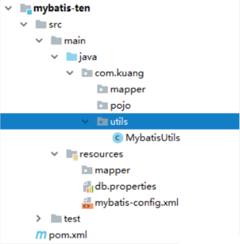

::: tip 

动态SQL在开发中大量的使用，一定要熟练掌握

:::

# MyBatis-动态SQL

## 一、介绍

什么是动态SQL：**动态SQL指的是根据不同的查询条件 , 生成不同的Sql语句**。

官网描述：

```
MyBatis 的强大特性之一便是它的动态 SQL。如果你有使用 JDBC 或其它类似框架的经验，你就能体会到根据不同条件拼接 SQL 语句的痛苦。例如拼接时要确保不能忘记添加必要的空格，还要注意去掉列表最后一个列名的逗号。利用动态 SQL 这一特性可以彻底摆脱这种痛苦。
虽然在以前使用动态 SQL 并非一件易事，但正是 MyBatis 提供了可以被用在任意 SQL 映射语句中的强大的动态 SQL 语言得以改进这种情形。
动态 SQL 元素和 JSTL 或基于类似 XML 的文本处理器相似。在 MyBatis 之前的版本中，有很多元素需要花时间了解。MyBatis 3 大大精简了元素种类，现在只需学习原来一半的元素便可。MyBatis 采用功能强大的基于 OGNL 的表达式来淘汰其它大部分元素。

-------------------------------
- if
- choose (when, otherwise)
- trim (where, set)
- foreach
-------------------------------
```

我们之前写的 SQL 语句都比较简单，如果有比较复杂的业务，我们需要写复杂的 SQL 语句，往往需要拼接，而拼接 SQL ，稍微不注意，由于引号，空格等缺失可能都会导致错误。

那么怎么去解决这个问题呢？这就要使用 Mybatis 动态SQL，通过 if, choose, when, otherwise, trim, where, set, foreach等标签，可组合成非常灵活的SQL语句，从而在提高 SQL 语句的准确性的同时，也大大提高了开发人员的效率。

## 二、搭建环境

**新建一个数据库表：blog**

字段：id，title，author，create_time，views

```sql
CREATE TABLE `blog` (
`id` varchar(50) NOT NULL COMMENT '博客id',
`title` varchar(100) NOT NULL COMMENT '博客标题',
`author` varchar(30) NOT NULL COMMENT '博客作者',
`create_time` datetime NOT NULL COMMENT '创建时间',
`views` int(30) NOT NULL COMMENT '浏览量'
) ENGINE=InnoDB DEFAULT CHARSET=utf8
```

1. 创建 Mybatis 基础工程：

   

2. IDutil 工具类

   ```java
   public class IDUtil {
      public static String genId(){
          return UUID.randomUUID().toString().replaceAll("-","");
     }
   }
   ```

3. 实体类编写【注意 set 方法的作用】：

   ```java
   import java.util.Date;
   
   public class Blog {
      private String id;
      private String title;
      private String author;
      private Date createTime;
      private int views;
      //set，get....
   }
   ```

4. 编写 Mapper 接口及 xml 文件：

   ```java
   public interface BlogMapper {
   }
   ```

   ```xml
   <?xml version="1.0" encoding="UTF-8" ?>
   <!DOCTYPE mapper
          PUBLIC "-//mybatis.org//DTD Mapper 3.0//EN"
          "http://mybatis.org/dtd/mybatis-3-mapper.dtd">
   <mapper namespace="com.kuang.mapper.BlogMapper">
   
   </mapper>
   ```

5. Mybatis 核心配置文件，下划线驼峰自动转换

   ```xml
   <settings>
       <setting name="mapUnderscoreToCamelCase" value="true"/>
       <setting name="logImpl" value="STDOUT_LOGGING"/>
   </settings>
   <!--注册Mapper.xml-->
   <mappers>
       <mapper resource="mapper/BlogMapper.xml"/>
   </mappers>
   ```

6. 插入初始数据：

   编写接口：

   ```java
   //新增一个博客
   int addBlog(Blog blog);
   ```

   sql 配置文件：

   ```xml
   <insert id="addBlog" parameterType="blog">
   	insert into blog (id, title, author, create_time, views)
   	values (#{id},#{title},#{author},#{createTime},#{views});
   </insert>
   ```

   初始化博客：

   ```java
   @Test
   public void addInitBlog(){
       SqlSession session = MybatisUtils.getSession();
       BlogMapper mapper = session.getMapper(BlogMapper.class);

   	Blog blog = new Blog();
   	blog.setId(IDUtil.genId());
   	blog.setTitle("Mybatis如此简单");
   	blog.setAuthor("SlovinG");
   	blog.setCreateTime(new Date());
   	blog.setViews(9999);

   	mapper.addBlog(blog);

   	blog.setId(IDUtil.genId());
   	blog.setTitle("Java如此简单");
   	mapper.addBlog(blog);

   	blog.setId(IDUtil.genId());
   	blog.setTitle("Spring如此简单");
   	mapper.addBlog(blog);

   	blog.setId(IDUtil.genId());
   	blog.setTitle("微服务如此简单");
   	mapper.addBlog(blog);

   	session.close();
}

初始化数据完毕！

## 三、if 语句

**需求：根据作者名字和博客名字来查询博客！如果作者名字为空，那么只根据博客名字查询，反之，则根据作者名来查询**

1、编写接口类

```java
//需求1
List<Blog> queryBlogIf(Map map);
```

2、编写SQL语句

```xml
<!--需求1：
根据作者名字和博客名字来查询博客！
如果作者名字为空，那么只根据博客名字查询，反之，则根据作者名来查询
select * from blog where title = #{title} and author = #{author}
-->
<select id="queryBlogIf" parameterType="map" resultType="blog">
  select * from blog where
   <if test="title != null">
      title = #{title}
   </if>
   <if test="author != null">
      and author = #{author}
   </if>
</select>
```

3、测试

```java
@Test
public void testQueryBlogIf(){
   SqlSession session = MybatisUtils.getSession();
   BlogMapper mapper = session.getMapper(BlogMapper.class);

   HashMap<String, String> map = new HashMap<String, String>();
   map.put("title","Mybatis如此简单");
   map.put("author","狂神说");
   List<Blog> blogs = mapper.queryBlogIf(map);

   System.out.println(blogs);

   session.close();
}
```

这样写我们可以看到，如果 author 等于 null，那么查询语句为 select * from user where title=#{title},但是如果title为空呢？那么查询语句为 select * from user where and author=#{author}，这是错误的 SQL 语句，如何解决呢？请看下面的 where 语句！

## 四、where

修改上面的SQL语句；

```xml
<select id="queryBlogIf" parameterType="map" resultType="blog">
  select * from blog
   <where>
       <if test="title != null">
          title = #{title}
       </if>
       <if test="author != null">
          and author = #{author}
       </if>
   </where>
</select>
```

这个“where”标签会知道如果它包含的标签中有返回值的话，它就插入一个‘where’。此外，如果标签返回的内容是以 AND 或 OR 开头的，则它会剔除掉。

## 五、set

同理，上面的对于查询 SQL 语句包含 where 关键字，如果在进行更新操作的时候，含有 set 关键词，我们怎么处理呢？

1、编写接口方法

```java
int updateBlog(Map map);
```

2、sql配置文件

```xml
<!--注意set是用的逗号隔开-->
<update id="updateBlog" parameterType="map">
  update blog
     <set>
         <if test="title != null">
            title = #{title},
         </if>
         <if test="author != null">
            author = #{author}
         </if>
     </set>
  where id = #{id};
</update>
```

3、测试

```java
@Test
public void testUpdateBlog(){
   SqlSession session = MybatisUtils.getSession();
   BlogMapper mapper = session.getMapper(BlogMapper.class);

   HashMap<String, String> map = new HashMap<String, String>();
   map.put("title","动态SQL");
   map.put("author","秦疆");
   map.put("id","9d6a763f5e1347cebda43e2a32687a77");

   mapper.updateBlog(map);


   session.close();
}
```

## 六、choose语句

有时候，我们不想用到所有的查询条件，只想选择其中的一个，查询条件有一个满足即可，使用 choose 标签可以解决此类问题，类似于 Java 的 switch 语句

1、编写接口方法

```java
List<Blog> queryBlogChoose(Map map);
```

2、sql配置文件

```xml
<select id="queryBlogChoose" parameterType="map" resultType="blog">
  select * from blog
   <where>
       <choose>
           <when test="title != null">
                title = #{title}
           </when>
           <when test="author != null">
              and author = #{author}
           </when>
           <otherwise>
              and views = #{views}
           </otherwise>
       </choose>
   </where>
</select>
```

3、测试类

```java
@Test
public void testQueryBlogChoose(){
   SqlSession session = MybatisUtils.getSession();
   BlogMapper mapper = session.getMapper(BlogMapper.class);

   HashMap<String, Object> map = new HashMap<String, Object>();
   map.put("title","Java如此简单");
   map.put("author","狂神说");
   map.put("views",9999);
   List<Blog> blogs = mapper.queryBlogChoose(map);

   System.out.println(blogs);

   session.close();
}
```

## 七、SQL片段

有时候可能某个 sql 语句我们用的特别多，为了增加代码的重用性，简化代码，我们需要将这些代码抽取出来，然后使用时直接调用。

**提取SQL片段：**

```xml
<sql id="if-title-author">
   <if test="title != null">
      title = #{title}
   </if>
   <if test="author != null">
      and author = #{author}
   </if>
</sql>
```

**引用SQL片段：**

```xml
<select id="queryBlogIf" parameterType="map" resultType="blog">
  select * from blog
   <where>
       <!-- 引用 sql 片段，如果refid 指定的不在本文件中，那么需要在前面加上 namespace -->
       <include refid="if-title-author"></include>
       <!-- 在这里还可以引用其他的 sql 片段 -->
   </where>
</select>
```

注意：

1. 最好基于 **单表** 来定义 sql 片段，提高片段的可重用性
2. 在 sql 片段中不要包括 where

## 八、Foreach

将数据库中前三个数据的id修改为1,2,3；

需求：我们需要查询 blog 表中 id 分别为1,2,3的博客信息

1、编写接口

```java
List<Blog> queryBlogForeach(Map map);
```

2、编写SQL语句

```xml
<select id="queryBlogForeach" parameterType="map" resultType="blog">
  select * from blog
   <where>
       <!--
       collection:指定输入对象中的集合属性
       item:每次遍历生成的对象
       open:开始遍历时的拼接字符串
       close:结束时拼接的字符串
       separator:遍历对象之间需要拼接的字符串
       select * from blog where 1=1 and (id=1 or id=2 or id=3)
     -->
       <foreach collection="ids"  item="id" open="and (" close=")" separator="or">
          id=#{id}
       </foreach>
   </where>
</select>
```

3、测试

```java
@Test
public void testQueryBlogForeach(){
   SqlSession session = MybatisUtils.getSession();
   BlogMapper mapper = session.getMapper(BlogMapper.class);

   HashMap map = new HashMap();
   List<Integer> ids = new ArrayList<Integer>();
   ids.add(1);
   ids.add(2);
   ids.add(3);
   map.put("ids",ids);

   List<Blog> blogs = mapper.queryBlogForeach(map);

   System.out.println(blogs);

   session.close();
}
```

小结：其实动态 sql 语句的编写往往就是一个拼接的问题，为了保证拼接准确，我们最好首先要写原生的 sql 语句出来，然后在通过 mybatis 动态sql 对照着改，防止出错。多在实践中使用才是熟练掌握它的技巧。
