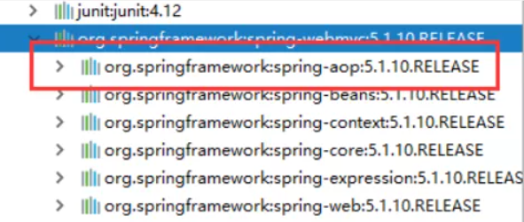

# Spring-使用注解开发

## 一、说明

在spring4之后，想要使用注解形式，必须得要引入aop的包：



在配置文件当中，还得要引入一个 context 约束：

```xml
<?xml version="1.0" encoding="UTF-8"?>
<beans xmlns="http://www.springframework.org/schema/beans"
      xmlns:xsi="http://www.w3.org/2001/XMLSchema-instance"
      xmlns:context="http://www.springframework.org/schema/context"
      xsi:schemaLocation="http://www.springframework.org/schema/beans
       http://www.springframework.org/schema/beans/spring-beans.xsd
       http://www.springframework.org/schema/context
       http://www.springframework.org/schema/context/spring-context.xsd">

</beans>
```

## 二、Bean 的实现

我们之前都是使用 bean 的标签进行 bean 注入，但是实际开发中，我们一般都会使用注解！

1. 配置扫描哪些包下的注解

   ```xml
   <!--指定注解扫描包-->
   <context:component-scan base-package="com.kuang.pojo"/>
   ```

2. 在指定包下编写类，增加注解

   ```java
   @Component("user")
   // 相当于配置文件中 <bean id="user" class="当前注解的类"/>
   public class User {
      public String name = "秦疆";
   }
   ```

   如果 @Component 注解没有使用参数指定 Bean 的名称，那么 **类名首字母小写** 就是 Bean 在 IOC 容器中的默认名称。例如： BookServiceImpl 对象在 IOC 容器中的名称是 bookServiceImpl。

3. 测试

   ```java
   @Test
   public void test(){
      ApplicationContext applicationContext = new ClassPathXmlApplicationContext("beans.xml");
      User user = (User) applicationContext.getBean("user");
      System.out.println(user.name);
   }
   ```

## 三、属性注入

使用注解也可以来注入属性。

- 可以不用提供 set 方法，直接在直接名上添加 **@value("值")**

  ```java
  @Component("user")
  // 相当于配置文件中 <bean id="user" class="当前注解的类"/>
  public class User {
     @Value("SlovinG")
     // 相当于配置文件中 <property name="name" value="SlovinG"/>
     public String name;
  }
  ```

- 如果提供了 set 方法，在 set 方法上添加 **@value("值")**

  ```java
  @Component("user")
  public class User {
     public String name;
     @Value("SlovinG")
     public void setName(String name) {
         this.name = name;
    }
  }
  ```

## 四、衍生注解

我们这些注解，就是替代了在配置文件当中配置步骤而已，更加的方便快捷！

**@Component 的三个衍生注解**

为了更好的进行分层，Spring 可以使用其它三个注解，功能一样，目前使用哪一个功能都一样。

- @Controller：web 层
- @Service：service 层
- @Repository：dao 层

写上这些注解，就相当于将这个类交给 Spring 管理装配。

## 五、自动装配注解

在Bean的自动装配已经讲过了，可以回顾！

## 六、作用域

@scope

- singleton：单例模式（默认）。关闭工厂 ，所有的对象都会销毁。
- prototype：多例模式。关闭工厂 ，所有的对象不会销毁。内部的垃圾回收机制会回收

```java
@Controller("user")
@Scope("prototype")
public class User {
   @Value("SlovinG")
   public String name;
}
```

## 七、小结

**XML 与注解比较**

- XML 可以适用任何场景 ，结构清晰，维护方便
- 注解不是自己提供的类使用不了，开发简单方便

**xml 与注解整合开发** ：推荐最佳实践

- xml 管理 Bean
- 注解完成属性注入
- 使用过程中， 可以不用扫描，扫描是为了类上的注解

```xml
<context:annotation-config/>  
```

作用：

- 进行注解驱动注册，从而使注解生效
- 用于激活那些已经在 spring 容器里注册过的 bean 上面的注解，也就是显示的向 Spring 注册
- 如果不扫描包，就需要手动配置 bean
- 如果不加注解驱动，则注入的值为 null

## 八、基于 Java 类进行配置

JavaConfig 原来是 Spring 的一个子项目，它通过 Java 类的方式提供 Bean 的定义信息，在 Spring4 的版本， JavaConfig 已正式成为 Spring4 的核心功能 。

测试：

1. 编写一个实体类 Dog

   ```java
   @Component  //将这个类标注为Spring的一个组件，放到容器中！
   public class Dog {
      public String name = "dog";
   }
   ```

2. 新建一个 config 配置包，编写一个 MyConfig 配置类

   ```java
   @Configuration  //代表这是一个配置类
   public class MyConfig {
      @Bean //通过方法注册一个bean，这里的返回值就Bean的类型，方法名就是bean的id！
      public Dog dog(){
          return new Dog();
     }
   }
   ```

3. 测试

   ```java
   @Test
   public void test2(){
      ApplicationContext applicationContext = new AnnotationConfigApplicationContext(MyConfig.class);
      Dog dog = (Dog) applicationContext.getBean("dog");
      System.out.println(dog.name);
   }
   ```

4. 成功输出结果。

## 九、如何导入其他配置

我们再编写一个配置类：

```java
@Configuration  //代表这是一个配置类
public class MyConfig2 {
}
```

方式一：在之前的配置类中我们使用 **@Import** 选择导入这个配置类

```java
@Configuration
@Import(MyConfig2.class)  //导入合并其他配置类，类似于配置文件中的 inculde 标签
public class MyConfig {
   @Bean
   public Dog dog(){
       return new Dog();
  }
}
```

方式二：使用 **@ComponentScan** 扫描其他的包

```java
@Configuration
@ComponentScan({"com.itheima.config","com.itheima.service","com.itheima.dao"})  
//只要com.itheima.config包扫到了就行，三个包可以合并写成com.itheima
public class SpringConfig {
}
```

关于这种 Java 类的配置方式，我们在之后的 SpringBoot 和 SpringCloud 中还会大量看到，我们需要知道这些注解的作用即可！
